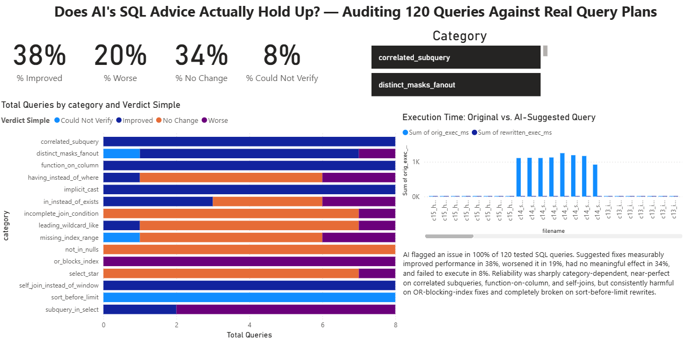

# AI SQL Auditor — Does AI's SQL Advice Actually Hold Up?

AI coding assistants constantly suggest SQL "optimizations." Nobody
usually checks if they're actually right. This project does — across
**120 queries spanning 15 real-world SQL anti-pattern categories**,
verified against real Postgres query plans, not just taken on faith.

## The headline finding

> AI (Claude) flagged an issue in **100%** of 120 tested SQL queries.
> Its suggested rewrites were then benchmarked against the originals using
> `EXPLAIN ANALYZE` on real (synthetic) Postgres data. The suggested fix
> **measurably improved performance in 38%** of cases, **made it worse in
> 20%**, produced **no meaningful change in 34%**, and **failed to execute
> at all in 8%**.
>
> Reliability was sharply **category-dependent** — near-perfect on
> correlated subqueries, function-wrapped filter columns, implicit type
> casts, and self-joins rewritten as window functions (all 100% improved,
> some 99%+ faster). But AI's fixes were consistently **harmful** on
> OR-conditions blocking index usage (100% made things worse, some 300%+
> slower), and its rewrites for sort-before-limit queries **failed to
> execute at all, every single time**.


*(Power BI dashboard — see `ai_sql_auditor_dashboard.pbix` for the interactive version)*

## Why this matters

Everyone's resume says "I use AI coding assistants." That's expected now,
not a differentiator. What actually matters is whether you **verify** AI's
output rather than trust it by default — this project is a structured test
of exactly that question, with a large enough sample (120 queries, 15
categories) to say something more specific than a one-off anecdote.

## Methodology

1. **Schema & data**: a TPC-H-style 8-table schema (`customer`, `orders`,
   `lineitem`, `supplier`, `part`, etc.) populated with ~80K synthetic rows
   — enough for real query plan differences to show up under `EXPLAIN
   ANALYZE`, without needing a huge dataset.
2. **Query generation**: a templated generator (`generate_queries.py`)
   programmatically produces 120 queries — 8 varied instances across each
   of 15 well-known SQL anti-pattern categories (correlated subqueries,
   `SELECT *`, `NOT IN` with nulls, functions wrapped around filter
   columns, missing indexes, `OR` conditions blocking index use, leading
   wildcard `LIKE`, implicit type casts, incomplete join conditions,
   `DISTINCT` masking join fan-out, N+1-style subqueries in `SELECT`,
   unnecessary sorts before `LIMIT`, `IN` vs `EXISTS`, inefficient
   self-joins, and `HAVING` used where `WHERE` would do).
3. **AI review**: each query is sent to Claude (`ai_audit.py`) for review,
   returning a structured verdict, severity, explanation, and suggested
   rewrite.
4. **Verification**: `verify_with_explain.py` runs `EXPLAIN (ANALYZE,
   FORMAT JSON)` on both the original and the AI-suggested rewrite,
   recording actual execution time and whether the suggestion measurably
   helped, hurt, made no difference, or didn't even run.
5. **(Optional supplement)**: `fetch_real_world_queries.py` and
   `audit_real_world.py` pull real open-source SQL from a public dbt demo
   project via the GitHub API for a qualitative-only review — clearly
   *not* execution-verified, kept separate from the core findings.

## Tech stack

Python · PostgreSQL · Claude API (Anthropic) · Power BI · GitHub API

## Repo contents

| File | Purpose |
|---|---|
| `schema.sql` | Database schema |
| `generate_data.py` / `load_data.sql` | Synthetic data generation & loading |
| `generate_queries.py` | Generates the 120 test queries |
| `queries/` | The 120 generated `.sql` files |
| `ai_audit.py` | Sends queries to Claude, gets structured review + rewrite |
| `verify_with_explain.py` | Runs `EXPLAIN ANALYZE`, produces verdicts |
| `results/verified_results.csv` | Final results feeding the dashboard |
| `fetch_real_world_queries.py` / `audit_real_world.py` | Optional real-world qualitative supplement |
| `ai_sql_auditor_dashboard.pbix` | Power BI dashboard |
| `SETUP.md` | Full step-by-step local setup instructions |

## Running it yourself

```bash
# 1. Set up the database
createdb sql_auditor
psql -d sql_auditor -f schema.sql

# 2. Generate and load synthetic data
pip install faker
python generate_data.py
psql -d sql_auditor -f load_data.sql

# 3. Generate the 120 test queries
python generate_queries.py

# 4. Run the AI audit (requires an Anthropic API key)
pip install anthropic
export ANTHROPIC_API_KEY="your-key-here"
python ai_audit.py

# 5. Verify against real query plans
pip install psycopg2-binary
export SQL_AUDITOR_DSN="dbname=sql_auditor user=postgres password=yourpassword"
python verify_with_explain.py

# 6. Open results/verified_results.csv in Power BI, or open the .pbix directly
```

See `SETUP.md` for the fully detailed walkthrough, including Windows-specific
notes and troubleshooting.

## Honest limitations

- 120 queries across 15 categories is a solid scale for a portfolio
  project, but it's a synthetic benchmark on synthetic data, not a claim
  about every SQL pattern or every LLM.
- Results are specific to the model used (Claude Sonnet) and the exact
  prompt — a different model or prompt could reasonably produce different
  reliability numbers.
- One bug was caught and fixed mid-project (a missing `SELECT` keyword in
  the correlated-subquery query template caused 8 queries to be
  unexecutable as originally written) — fixed and re-verified before the
  final results above.
